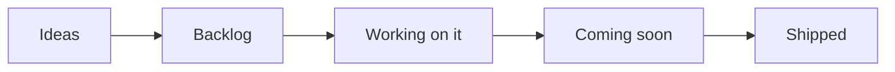
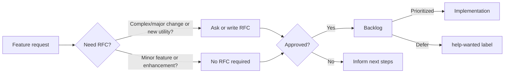

<!-- markdownlint-disable MD043 MD041 -->
## Overview

Our public roadmap outlines the high level direction we are working towards. We update this document when our priorities change: security and stability are our top priority.

!!! info "For most up-to-date information, see our [board of activities](https://github.com/orgs/aws-powertools/projects/3?query=sort%3Aupdated-desc+is%3Aopen){target="_blank"}."

### Key areas

Security and operational excellence take precedence above all else. This means bug fixing, stability, customer's support, and internal compliance may delay one or more key areas below.

**Missing something or want us to prioritize an existing area?**

You can help us prioritize by [upvoting existing feature requests](https://github.com/aws-powertools/powertools-lambda-python/issues?q=is%3Aissue+is%3Aopen+sort%3Aupdated-desc+label%3Afeature-request), leaving a comment on what use cases it could unblock for you, and by joining our discussions on Discord.

#### New features and utilities (p0)

We will create new features and utilities to solve practical problems developers face when building serverless applications.

- [ ] [Ability to buffer logs](https://github.com/aws-powertools/powertools-lambda-typescript/discussions/3410){target="_blank"}
- [ ] Async event handlers to streamline complex event-driven workflows across SQS, EventBridge

#### Powertools toolchain (p1)

To improve Lambda development workflows and tooling capabilities, we aim to demonstrate how to simplify complex packaging methods, enable OpenAPI code generation for multiple Lambda functions, and introduce profiling tools to evaluate Powertools for AWS Lambda (Python) code implementation, tracking memory consumption and computational performance.

- [ ] Create a comprehensive "Recipes" section with Lambda packaging tutorials for tools like uv, poetry, pants, providing clear, practical build strategies.
- [ ] Enable OpenAPI generation capabilities to create specifications across multiple Lambda functions, eliminating LambdaLith architectural constraints.

#### Support for async (p2)

Python's serverless ecosystem is increasingly adopting asynchronous programming to deliver more efficient, non-blocking applications.

- [ ] Add support for aioboto3 or other tool, enabling efficient, non-blocking AWS service interactions in Lambda functions.
- [ ] Write a PoC with Event Handler support for async.

## Roadmap status definition

<i>Visual representation</i>

Within our [public board](https://github.com/orgs/aws-powertools/projects/3/views/1?query=is%3Aopen+sort%3Aupdated-desc){target="_blank"}, you'll see the following values in the `Status` column:

- **Ideas**. Incoming and existing feature requests that are not being actively considered yet. These will be reviewed when bandwidth permits.
- **Backlog**. Accepted feature requests or enhancements that we want to work on.
- **Working on it**. Features or enhancements we're currently either researching or implementing it.
- **Coming soon**. Any feature, enhancement, or bug fixes that have been merged and are coming in the next release.
- **Shipped**. Features or enhancements that are now available in the most recent release.

> Tasks or issues with empty `Status` will be categorized in upcoming review cycles.

## Process

<i>Visual representation</i>

Our end-to-end mechanism follows four major steps:

- **Feature Request**. Ideas start with a [feature request](https://github.com/aws-powertools/powertools-lambda-python/issues/new?assignees=&labels=feature-request%2Ctriage&template=feature_request.yml&title=Feature+request%3A+TITLE){target="_blank"} to outline their use case at a high level. For complex use cases, maintainers might ask for/write a RFC.
    - Maintainers review requests based on [project tenets](index.md#tenets){target="_blank"}, customers reaction (👍), and use cases.
- **Request-for-comments (RFC)**. Design proposals use our [RFC issue template](https://github.com/aws-powertools/powertools-lambda-python/issues/new?assignees=&labels=RFC%2Ctriage&template=rfc.yml&title=RFC%3A+TITLE){target="_blank"} to describe its implementation, challenges, developer experience, dependencies, and alternative solutions.
    - This helps refine the initial idea with community feedback before a decision is made.
- **Decision**. After carefully reviewing and discussing them, maintainers make a final decision on whether to start implementation, defer or reject it, and update everyone with the next steps.
- **Implementation**. For approved features, maintainers give priority to the original authors for implementation unless it is a sensitive task that is best handled by maintainers.

???+ info "See [Maintainers](https://github.com/aws-powertools/powertools-lambda-python/blob/develop/MAINTAINERS.md){target="_blank"} document to understand how we triage issues and pull requests, labels and governance."

## Disclaimer

The Powertools for AWS Lambda (Python) team values feedback and guidance from its community of users, although final decisions on inclusion into the project will be made by AWS.

We determine the high-level direction for our open roadmap based on customer feedback and popularity (👍🏽 and comments), security and operational impacts, and business value. Where features don’t meet our goals and longer-term strategy, we will communicate that clearly and openly as quickly as possible with an explanation of why the decision was made.

## FAQs

**Q: Why did you build this?**

A: We know that our customers are making decisions and plans based on what we are developing, and we want to provide our customers the insights they need to plan.

**Q: Why are there no dates on your roadmap?**

A: Because job zero is security and operational stability, we can't provide specific target dates for features. The roadmap is subject to change at any time, and roadmap issues in this repository do not guarantee a feature will be launched as proposed.

**Q: How can I provide feedback or ask for more information?**

A: For existing features, you can directly comment on issues. For anything else, please open an issue.
